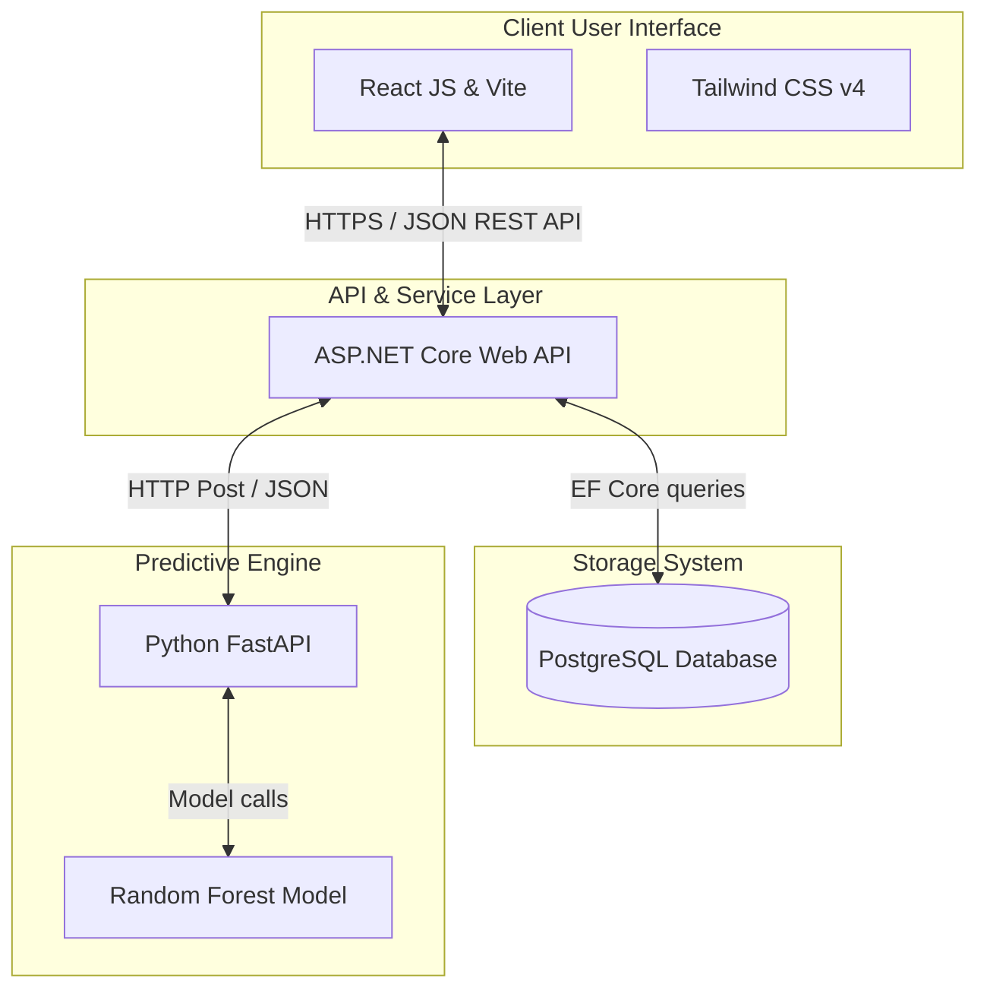
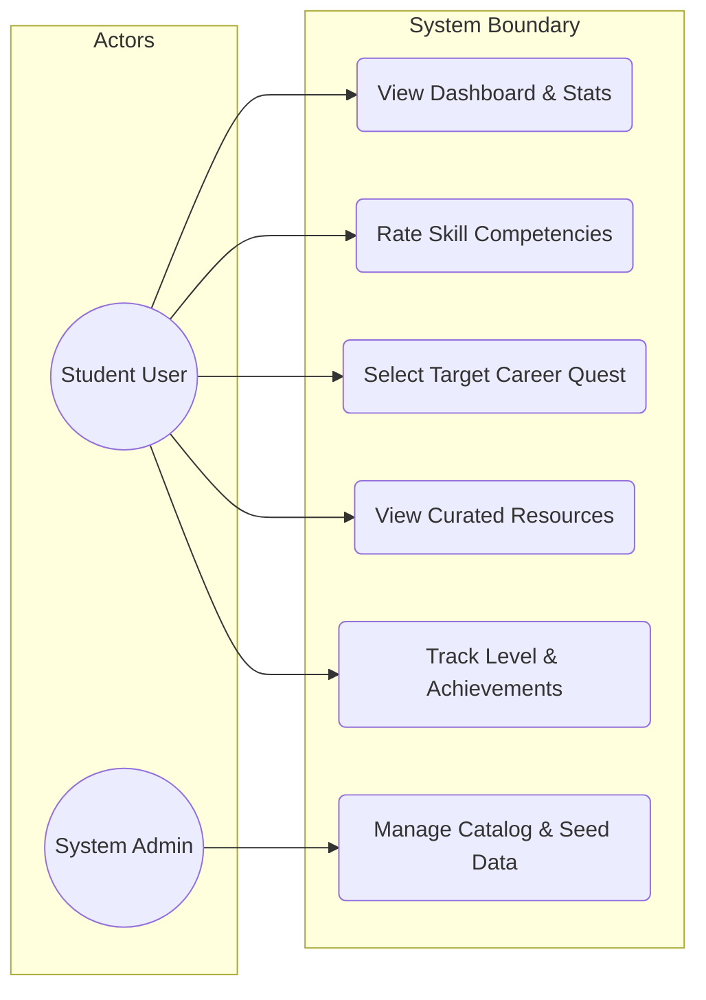
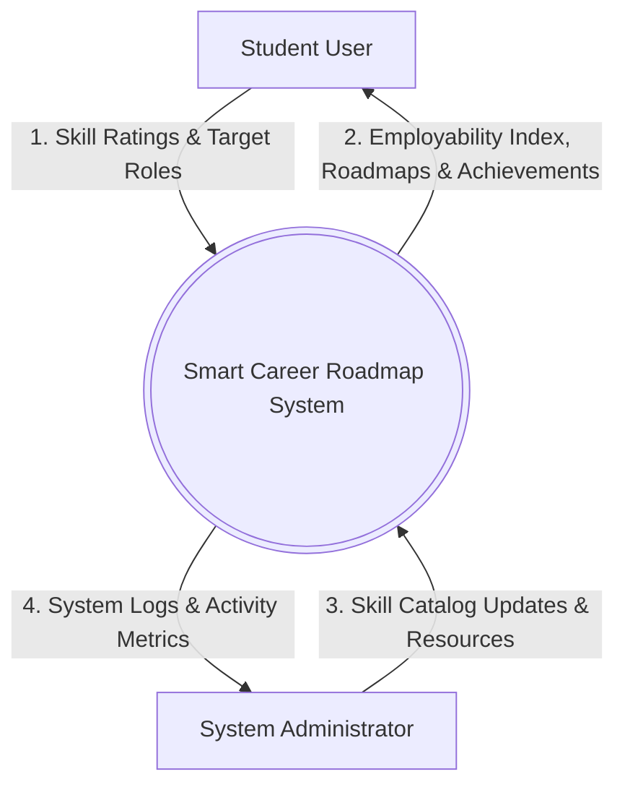
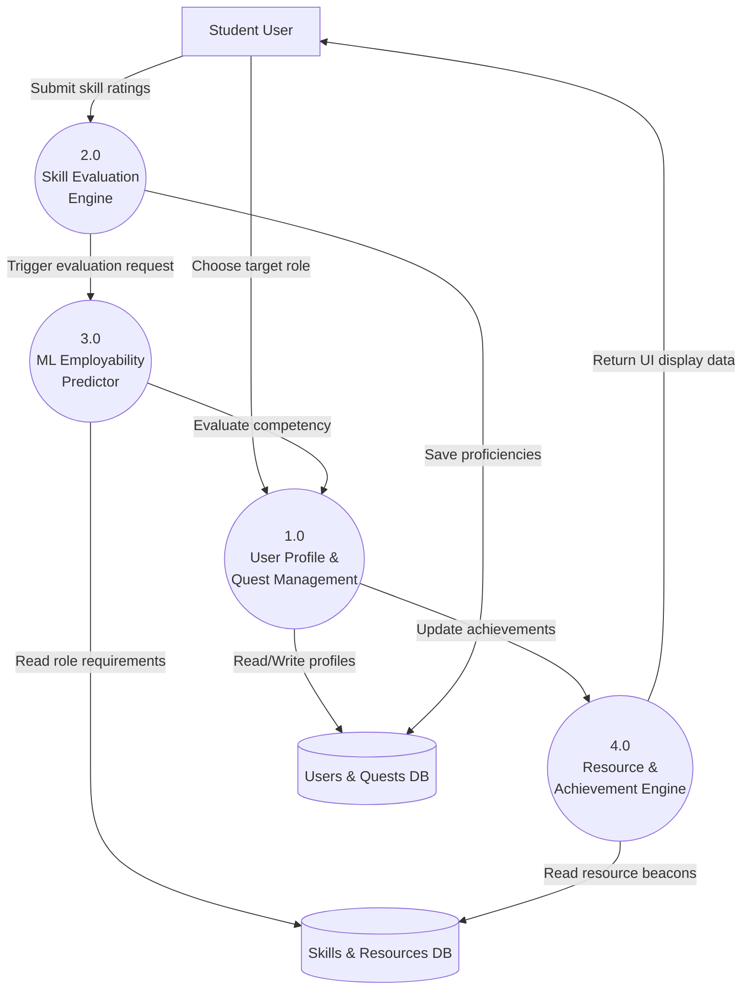
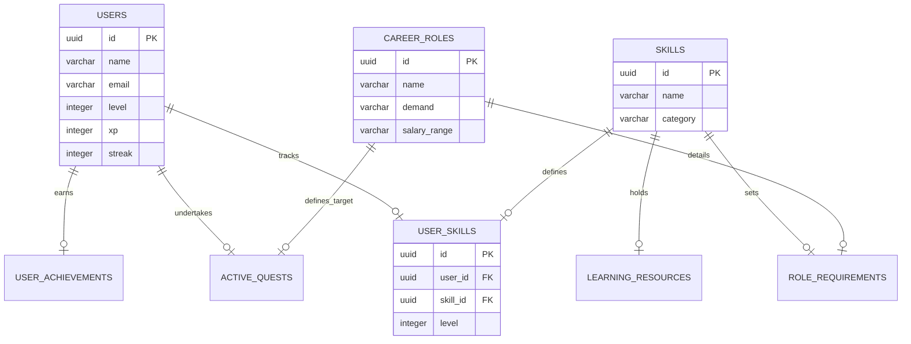
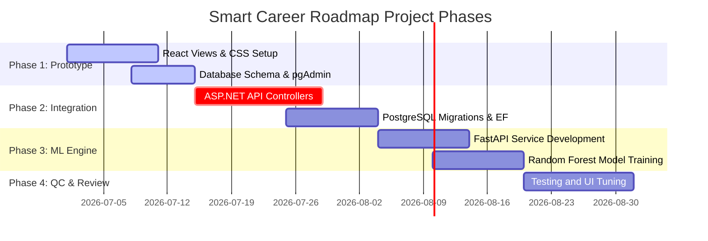
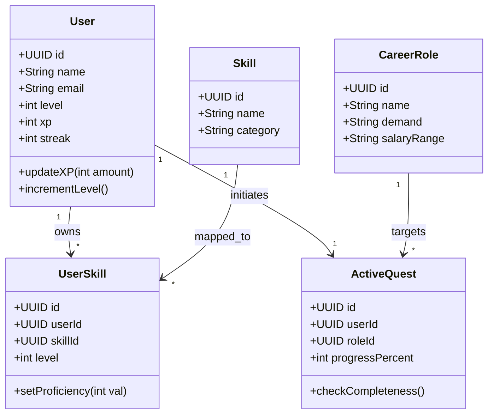
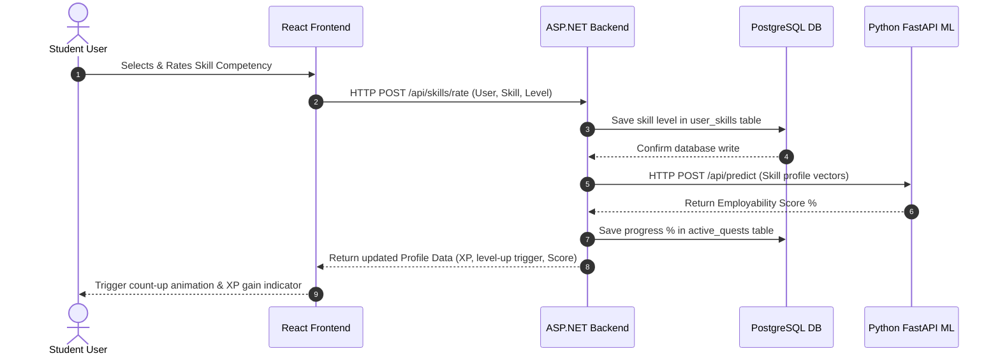
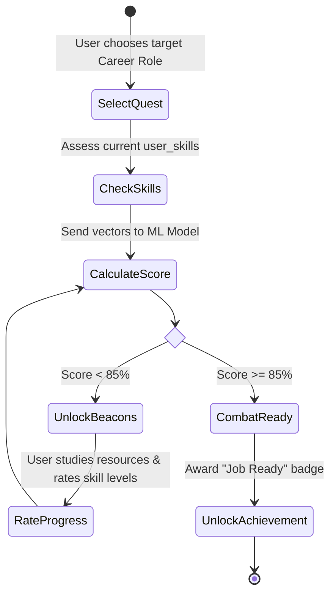
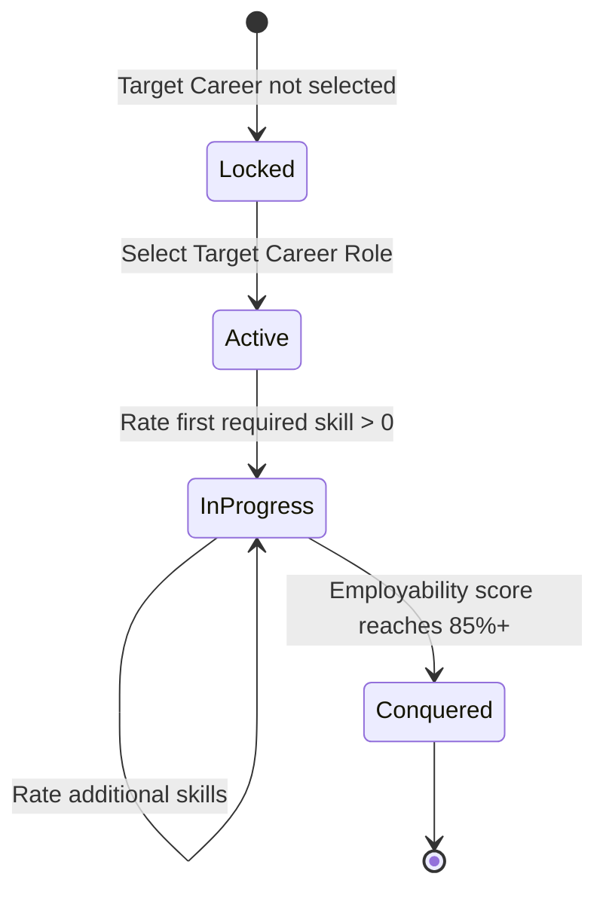

# 📊 Smart Career Roadmap — PowerPoint Copy-Paste Presentation Slide Deck

This file is structured specifically so you can **directly copy and paste** the titles and bullet points into your PowerPoint slides. 

*   For each slide, copy the text inside the blocks.
*   Mermaid codes are provided below each slide; copy them into the [Mermaid Live Editor](https://mermaid.live) to render and save them as images for your slides.

---

## 📑 Slide Outline & Copy-Paste Content

---

### Slide 1: Title Slide

**Slide Title (Copy):**
```text
Smart Career Roadmap: A Gamified Career RPG & Skill Gap Analyzer
```

**Slide Content (Copy):**
```text
• Project Review Presentation
• Presenter: Savan Chauhan (Frontend Developer) & Team
• Concept: Empowering students with dynamic, interactive, and personalized career roadmaps utilizing Machine Learning
```

**Speaker Notes:**
> "Welcome everyone. Today, I am presenting the 'Smart Career Roadmap' project review. Our system rejects the typical boring checklist style of career planning, transforming a student's professional growth into a gamified RPG (Role Playing Game) experience where career goals are Quests, and progress is driven by live Machine Learning insights."

---

### Slide 2: Abstract

**Slide Title (Copy):**
```text
Abstract
```

**Slide Content (Copy):**
```text
• The Problem: Rapidly evolving industrial domains make traditional static career roadmaps obsolete, leaving students confused about real-world requirements.
• The Solution: A gamified 'Career RPG' platform where students choose a target role ('Quest'), view required skill domains ('Spheres'), and track progress via levels & XP.
• The Intelligence: Built on a multi-tier decoupled architecture (React, ASP.NET Core, PostgreSQL) with a Python FastAPI ML service running a Random Forest Regressor to compute dynamic employability scores.
```

**Speaker Notes:**
> "In this abstract, we outline the core logic of our system: bridging the gap between educational readiness and industrial needs. By using an active feedback loop powered by Machine Learning, the system continuously analyzes the user's skill ratings to predict their current job readiness score, keeping them actively engaged."

---

### Slide 3: Problem Statement

**Slide Title (Copy):**
```text
Problem Statement
```

**Slide Content (Copy):**
```text
• Linear & Static Pathways: Traditional roadmaps are fixed files that do not adapt to industry changes or individual student skill progression.
• Ambiguous Readiness Metrics: Students lack a measurable, feedback-driven 'employability score' to show how their skills match market expectations.
• Low User Engagement: Plain checklists fail to motivate students, resulting in high learning dropout rates.
• Fragmented Learning Resources: High-quality tutorials and reference materials are scattered and rarely linked directly to specific skill deficiencies.
```

**Speaker Notes:**
> "The primary problem is static design and low engagement. Students do not know if they are actually ready for a job because there are no clear metrics. When they try to learn, they get lost looking for tutorials. We solve these problems by making roadmaps dynamic, measurable, and highly structured."

---

### Slide 4: Project Objective

**Slide Title (Copy):**
```text
Project Objectives
```

**Slide Content (Copy):**
```text
• Gamify Career Progress: Transform career roadmaps into RPG guild campaigns tracking user levels, streaks, and achievements.
• Provide Dynamic Scoring: Calculate a real-time 'Combat Readiness' score mapping user proficiencies against desired roles.
• Perform Actionable Gap Analysis: Visually highlight specific skill deficiencies blocking career progress.
• Seed Curated Resources: Embed high-quality tutorials and official documentation directly into targeted skill gaps.
• Maintain Scalable Architecture: Build a decoupled system with clean boundaries between frontend UI, backend APIs, and ML engines.
```

**Speaker Notes:**
> "Our objectives focus on gamification and clarity. We want to measure employability metrics dynamically, guide the user visually to fill their skill gaps, and provide curated learning links right where they are needed."

---

### Slide 5: Novelty & Key Differentiators

**Slide Title (Copy):**
```text
Project Novelty
```

**Slide Content (Copy):**
```text
• Traditional Platforms:
  - Flat profiles, plain forms, and checkboxes.
  - Static, manually designed career paths.
  - Self-assessed, unmeasured readiness values.
  - Generic learning paths.
• Smart Career Roadmap:
  - Immersive RPG theme (Guilds, Quests, Experience points, Streaks).
  - Dynamic skill weighting driven by industry data and Machine Learning.
  - Real-time calculated Employability Readiness index.
  - Contextual resource beacons mapped directly to identified skill gaps.
```

**Speaker Notes:**
> "This slide contrasts traditional learning dashboards with ours. Our novelty lies in turning career planning into a game while using Machine Learning to compute real-time readiness, ensuring the system remains both fun and scientifically grounded."

---

### Slide 6: Required Technologies & Tools

**Slide Title (Copy):**
```text
Technologies & Tools
```

**Slide Content (Copy):**
```text
• Frontend UI: React JS, Tailwind CSS v4, Lucide Icons, Vite
• Backend API: ASP.NET Core Web API, Entity Framework Core (EF Core)
• Database System: PostgreSQL Relational Database (via pgAdmin 4)
• Machine Learning Engine: Python Core, FastAPI, scikit-learn, Pandas, NumPy
• Utilities: Visual Studio Code, Git/GitHub, Postman (API verification)
```

**Speaker Notes:**
> "Here is our technology stack. We are using React and Tailwind for a modern, responsive user interface. The backend logic is managed by ASP.NET Core, storing data in PostgreSQL. The machine learning calculations are hosted on a separate Python FastAPI server running scikit-learn models."

---

### Slide 7: System Architecture

**Slide Title (Copy):**
```text
System Architecture
```

**Slide Content (Copy):**
*Insert the rendered diagram here*

**Mermaid Diagram Code:**


**Drawing Prompt (For Draw.io / Lucidchart):**
> "Draw a multi-tier software architecture diagram showing four logical columns: Client UI (React, Tailwind), Backend API (ASP.NET Core), Database Storage (PostgreSQL), and Machine Learning Microservice (Python FastAPI + scikit-learn). Show bidirectional connection arrows between Frontend and Backend, Backend and Database, and Backend and ML Microservice."

---

### Slide 8: Use Case Diagram

**Slide Title (Copy):**
```text
System Use Cases
```

**Slide Content (Copy):**
*Insert the rendered diagram here*

**Mermaid Diagram Code:**


**Drawing Prompt (For Draw.io / Lucidchart):**
> "Draw a standard UML Use Case Diagram inside a system boundary block labeled 'Smart Career Roadmap'. Put a stick figure on the left labeled 'Student User' and connect it to use cases: 'View Dashboard & Stats', 'Rate Skill Competencies', 'Select Target Career Quest', 'View Curated Resources', and 'Track Level & Achievements'. Put a stick figure on the right labeled 'System Admin' connected to 'Manage Catalog & Seed Data'."

---

### Slide 9: DFD Level-0 (Context Diagram)

**Slide Title (Copy):**
```text
Data Flow Diagram — Level 0
```

**Slide Content (Copy):**
*Insert the rendered diagram here*

**Mermaid Diagram Code:**


**Drawing Prompt (For Draw.io / Lucidchart):**
> "Draw a Level-0 Context DFD. Place a double-bordered circular process bubble in the center labeled 'Smart Career Roadmap System'. Draw an external entity rectangle on the left labeled 'Student User' sending data flow 'Skill Ratings & Target Roles' and receiving 'Employability Index, Roadmaps & Achievements'. Draw an external entity on the right labeled 'System Administrator' sending 'Skill Catalog Updates' and receiving 'Activity Metrics'."

---

### Slide 10: DFD Level-1 Diagram

**Slide Title (Copy):**
```text
Data Flow Diagram — Level 1
```

**Slide Content (Copy):**
*Insert the rendered diagram here*

**Mermaid Diagram Code:**


**Drawing Prompt (For Draw.io / Lucidchart):**
> "Create a DFD Level-1 Diagram with four circular processes: 1.0 User Profile & Quest Management, 2.0 Skill Evaluation Engine, 3.0 ML Employability Predictor, and 4.0 Resource & Achievement Engine. Show data stores (Users & Quests DB, Skills & Resources DB) and indicate how user skill ratings flow from the user through the evaluation processes to trigger the ML predictor, culminating in recommending resource beacons back to the user."

---

### Slide 11: Physical ER Diagram

**Slide Title (Copy):**
```text
Physical Entity Relationship Diagram (ERD)
```

**Slide Content (Copy):**
*Insert the rendered diagram here*

**Mermaid Diagram Code:**


**Drawing Prompt (For Draw.io / Lucidchart):**
> "Draw a physical entity-relationship diagram containing tables: USERS, SKILLS, USER_SKILLS (associative table), CAREER_ROLES, ROLE_REQUIREMENTS (associative table), ACTIVE_QUESTS, and LEARNING_RESOURCES. Show 1-to-many relationship lines with foreign key constraints, mapping User UUIDs and Skill UUIDs correctly."

---

### Slide 12: Gantt Chart (Project Roadmap)

**Slide Title (Copy):**
```text
Project Timeline (Gantt Chart)
```

**Slide Content (Copy):**
*Insert the rendered diagram here*

**Mermaid Diagram Code:**


**Drawing Prompt (For Draw.io / Lucidchart):**
> "Create a Gantt chart showing four phases running from July 1, 2026 to September 1, 2026: Phase 1: Interactive Frontend Prototype & Database Schema (First half of July), Phase 2: System Integration with ASP.NET Core & PostgreSQL (Late July to Early August), Phase 3: ML Engine Model development with FastAPI (Mid-August), and Phase 4: QC Testing and UI Fine-Tuning (Late August)."

---

### Slide 13: Class Diagram

**Slide Title (Copy):**
```text
UML Class Diagram
```

**Slide Content (Copy):**
*Insert the rendered diagram here*

**Mermaid Diagram Code:**


**Drawing Prompt (For Draw.io / Lucidchart):**
> "Draw a UML Class Diagram showing classes User, Skill, UserSkill, CareerRole, and ActiveQuest with basic attributes (+id, +name, etc.) and methods (+updateXP, +setProficiency). Use UML class connectors representing one-to-many associations between User and UserSkill, and User and ActiveQuest."

---

### Slide 14: Sequence Diagram

**Slide Title (Copy):**
```text
Sequence Diagram — Skill Evaluation
```

**Slide Content (Copy):**
*Insert the rendered diagram here*

**Mermaid Diagram Code:**


**Drawing Prompt (For Draw.io / Lucidchart):**
> "Draw a UML Sequence Diagram showing the flow: Student -> React Frontend -> ASP.NET Backend -> PostgreSQL DB -> Python FastAPI ML. Draw call arrows for rating updates, saving database states, requesting ML prediction calculations, storing progress, and returning updated levels/XP/animations back to the user."

---

### Slide 15: Activity Diagram

**Slide Title (Copy):**
```text
Activity Diagram — Quest Execution
```

**Slide Content (Copy):**
*Insert the rendered diagram here*

**Mermaid Diagram Code:**


**Drawing Prompt (For Draw.io / Lucidchart):**
> "Draw a UML Activity Diagram. Start node connects to activity 'User chooses target career quest', moving to 'Evaluate current skill levels', moving to a decision diamond evaluating 'Employability score >= 85%?'. If false, point to activity 'Display targeted learning resources & take action' which loops back to skill evaluation. If true, point to 'Unlock Job-Ready Badge' and end node."

---

### Slide 16: State Transition Diagram

**Slide Title (Copy):**
```text
State Transitions — Quest Lifecycle
```

**Slide Content (Copy):**
*Insert the rendered diagram here*

**Mermaid Diagram Code:**


**Drawing Prompt (For Draw.io / Lucidchart):**
> "Create a UML State Machine diagram tracking the life cycle of a Quest. States are: Locked (default), Active (when career path is selected), InProgress (when user rates a required skill), and Conquered (when employability score reaches 85%+). Draw transition arrows indicating actions like 'Choose target career', 'Rate skill level', and 'Reach 85% threshold'."

---

### Slide 17: Implementation Screenshot

**Slide Title (Copy):**
```text
Implementation Snapshot (Vite Dev Server)
```

**Slide Content (Copy):**
```text
• Active Development Server: http://localhost:5173/
• Main Interface Components:
  - RPG Character Card: Live level-up thresholds and streak trackers
  - Interactive Skill Matrix: Updates competency values instantly
  - Match Readiness Circular Gauge: Displays overall match score %
• Visual assets and files are saved under the project documentation directory
```

**Speaker Notes:**
> "Please reference the file 'docs/dashboard_screenshot.png' in our repository. This screenshot demonstrates the fully rendered, glowing Career RPG dashboard that is running live on our local machine."

---

### Slide 18: Summary & Conclusion

**Slide Title (Copy):**
```text
Conclusion & Next Steps
```

**Slide Content (Copy):**
```text
• UI Usability Verified: The interface successfully combines classic gaming elements with modern, clean typography (Inter & Cinzel).
• Multi-Service Scalability: Clean boundaries between components prevent logic overlaps and ensure high data reliability.
• Next Steps:
  - Integrate database migrations with raw ASP.NET Core API endpoints.
  - Wire front-end event callbacks to record skill ratings directly in the PostgreSQL database.
  - Deploy the Machine Learning Random Forest Regressor models on the FastAPI service.
```

**Speaker Notes:**
> "In conclusion, we have built a beautiful, working frontend dashboard mockup and the foundational PostgreSQL database structures. Our next milestones involve wiring the database entities to ASP.NET Core web controllers and importing historical job profiles to train the ML predictor. Thank you!"
